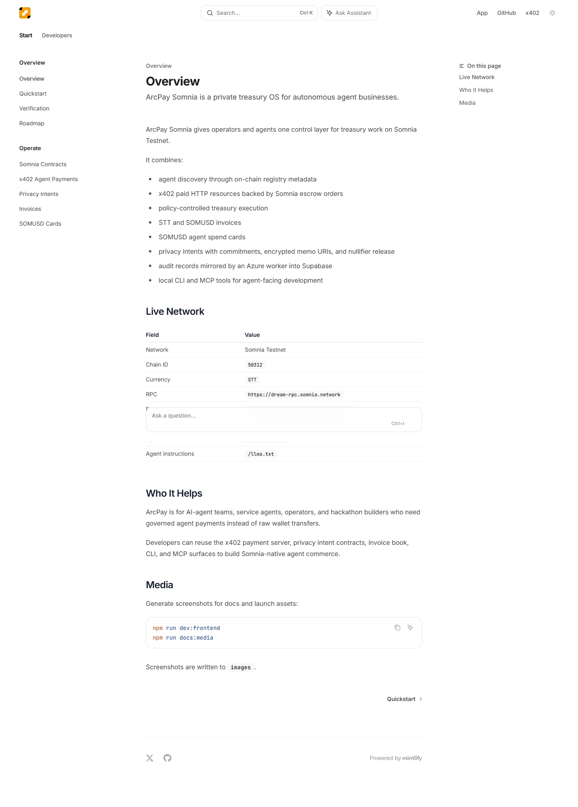

ArcPay Mantle gives operators and agents one control layer for treasury work on Mantle Testnet.

It combines:

- agent discovery through on-chain registry metadata
- x402 paid HTTP resources backed by Mantle escrow orders
- policy-controlled treasury execution
- MNT and USDY invoices
- USDY agent spend cards
- mETH and USDY strategy intents for AI x RWA treasury planning
- Byreal/RealClaw-ready agent tool surfaces through CLI, MCP, and HTTP APIs
- privacy intents with commitments, encrypted memo URIs, and nullifier release
- order-backed agent reputation
- audit records mirrored by an Azure worker into Supabase
- local CLI and MCP tools for agent-facing development

## Live Network

| Field | Value |
| --- | --- |
| Network | Mantle Testnet |
| Chain ID | `5003` |
| Currency | `MNT` |
| RPC | `https://rpc.sepolia.mantle.xyz` |
| Explorer | `https://sepolia.mantlescan.xyz` |
| x402 server | `https://mantle-x402.20.208.46.195.nip.io` |
| OpenAPI | `/openapi.json` |
| Agent instructions | `/llms.txt` |

## Track Fit

ArcPay Mantle is primarily built for the Agentic Wallets & Economy track and
also aligns with AI x RWA and AI DevTools:

- Agentic Wallets & Economy: agents can register services, receive x402 paid
  work, operate under spend policy, and produce on-chain reputation.
- AI x RWA: operators can model governed USDY/mETH treasury actions through
  invoices, cards, privacy intents, and strategy records.
- AI DevTools: Mantle builders get CLI, MCP, OpenAPI, starter-kit, and
  verification surfaces for building their own agent workflows.

## Who It Helps

ArcPay is for AI-agent teams, service agents, operators, and Mantle builders who need governed agent payments instead of raw wallet transfers.

Developers can reuse the x402 payment server, privacy intent contracts, invoice book, CLI, and MCP surfaces to build Mantle-native agent commerce.

## Verified Claims

Every feature documented here maps to code in this repository, a deployed Mantle Testnet contract, a public x402 endpoint, or a local smoke-test command. If a feature is roadmap-only, it is listed in `Roadmap` rather than described as live.

## Media

Generate screenshots for docs and launch assets:

```bash
npm run dev:frontend
npm run docs:media
```

Screenshots are written to `images`.

## Product Screens



