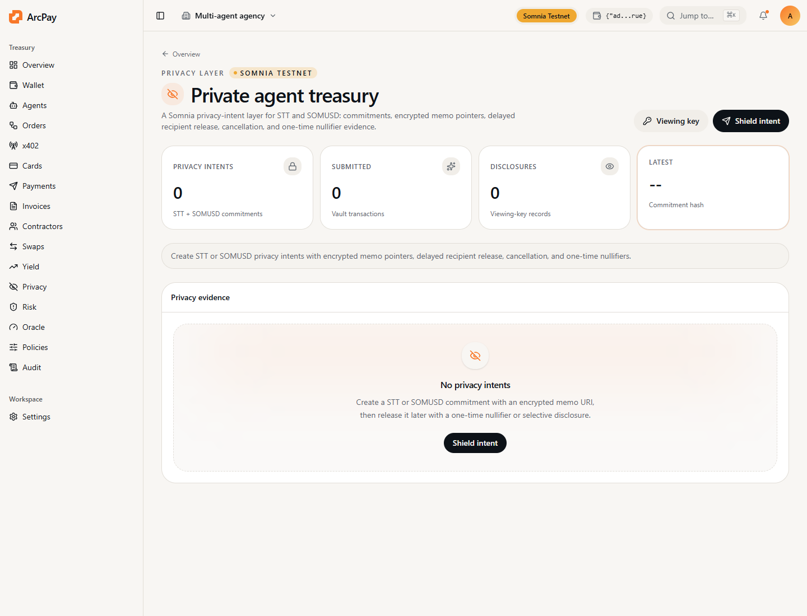

Mantle does not currently ship a native treasury privacy layer. ArcPay adds a builder-usable privacy intent contract for agent payment workflows.

## Privacy Boundary

This is not a full ZK mixer. It provides application-level privacy:

- commitment IDs instead of plain business IDs
- encrypted memo URI instead of public invoice or contractor metadata
- recipient hidden until release
- one-time nullifier release
- cancellation and refund while unreleased
- on-chain release evidence for audits

The live token paths are MNT and ArcPay Test Credit on Mantle Sepolia. USDY
and mETH remain mainnet/reference-only until official Mantle Sepolia assets are
available.

## Solidity Interface

```solidity
function createNativeIntent(bytes32 commitment, string calldata encryptedMemoUri) external payable;
function createTokenIntent(bytes32 commitment, address token, uint256 amount, string calldata encryptedMemoUri) external;
function releaseIntent(bytes32 commitment, bytes32 nullifier, address payable recipient) external;
function cancelIntent(bytes32 commitment) external;
```

## Developer Flow

```ts
const commitment = keccak256(toUtf8Bytes("invoice-42-secret"));
const nullifier = keccak256(toUtf8Bytes("release-secret-42"));

await privacyVault.createNativeIntent(
  commitment,
  "encrypted://memo-or-ipfs-pointer",
  { value: parseEther("0.01") },
);

await privacyVault.releaseIntent(commitment, nullifier, recipient);
```

## Helpers

```bash
npm run arcpay -- privacy-commit "invoice-42-secret"
npm run arcpay -- privacy-guide
npm run arcpay -- privacy-abi
```

## Noir Roadmap Boundary

ArcPay includes a circuit-ready direction for proving a payment intent was
authorized without revealing the secret off-chain memo. Do not claim this as a
deployed verifier until the full Noir toolchain has been run:

```bash
cd circuits/mantle-privacy-intent
nargo check
nargo execute
bb prove -b ./target/mantle_privacy_intent.json -w ./target/mantle_privacy_intent.gz -o ./proofs
bb write_vk -b ./target/mantle_privacy_intent.json -o ./proofs
bb write_solidity_verifier -k ./proofs/vk -o ./proofs/MantlePrivacyIntentVerifier.sol
```

Submission-safe claim today: live commitment/nullifier privacy intents on
Mantle Sepolia, plus a documented Noir verifier path for the next privacy
upgrade.

## Product Screen


